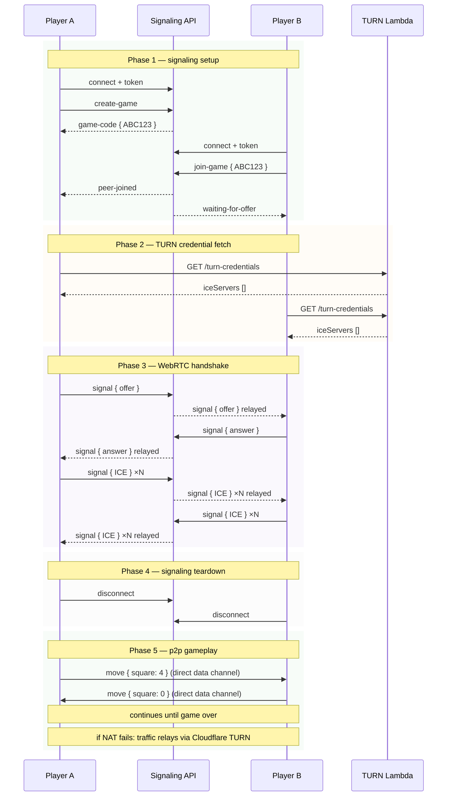
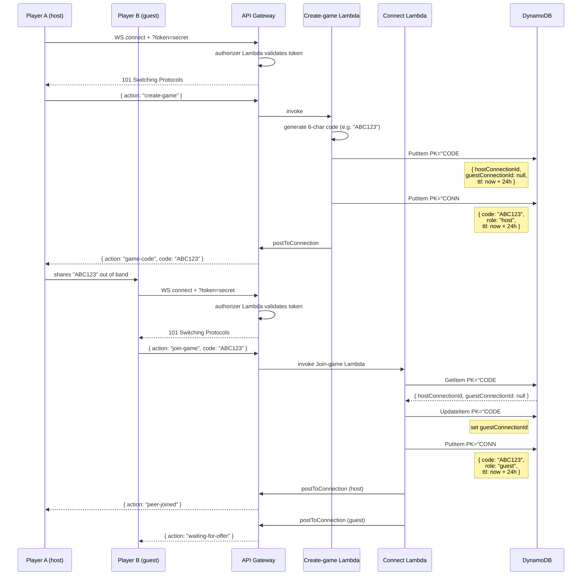

## Table of Contents

# Overview

This is a web implementation of one of my favorite board games: 3D Tic-Tac-Toe. If you're not already familiar with 3DTTT, its [Wikipedia article](https://en.wikipedia.org/wiki/3D_tic-tac-toe) gives an excellent explanation of the rules, although it's fairly intuitive if you're already familiar with its 2D counterpart. The game is played on a 4x4x4 grid, and the object of the game is to get 4 of your pieces in a row. Simple.

I was first introduced to the game as a teenager when I attended Missouri Scholars Academy. There, I got to play against a lot of extremely clever opponents, which gave me a real appreciation for how deep 3DTTT could be as a game. Most of us know the 2D version of the game, and we also know that it's a textbook example of a [solved game](https://en.wikipedia.org/wiki/Solved_game). That is, if both players play perfectly (which isn't hard to do for a game so trivial), the outcome will always be the same (which, for Tic-Tac-Toe, means a draw). However, 3DTTT is much more difficult to play perfectly, and thus, much more interesting.

I originally had a bunch more writing here about the fascinating history of mathematicians & computer scientists using different strategies to analyze 3DTTT and attempt to "solve" it, but that's too big a rabbit hole to cover here. Perhaps I'll make a blog post about it at some point, but in the meantime, if you don't have an aversion to mathematical proofs and game theory, I'd recommend looking into it yourself. It really is very interesting stuff.

# Architecture

## Peer-To-Peer Instead of Dedicated Server
When I first set out to make this project, I'd envisioned a dedicated server which would connect to both players and facilitate the game. However, when I actually sat down to plan out the whole thing, I realized that perhaps a dedicated game server wasn't the best architectural approach, and I began considering a peer-to-peer architecture instead. Here are the pros and cons of each approach that I ultimately came up with.

- P2P Pros:
	- Very scalable since the backend is only responsible for establishing connections between players
	- Very inexpensive
	- More resilient to service outages (my BE server going down doesn't interrupt active games)
	- Less technical overhead that I have to maintain overall
	- Once it's working, I can reuse the same architecture to facilitate other games should I want to
- P2P Cons:
	- TURN tunnelling problem (though there are several free (at small scale) third-party offerings for this)
	- Connection instability
	- People can cheat (though I don't really care about this)
	- lack of observability (once I've connected people, I have no idea if something goes wrong)
- Dedicated Server Pros:
	- Prevent cheating by centrally enforcing game logic and maintaining state
	- More observable when it comes to connection issues/errors
	- Simpler connection implementation (no TURN, no facilitating handshake)
- Dedicated Server Cons:
	- Much more expensive or much slower depending on how it's implemented
	- More technical overhead & maintenance cost

In the end, it mostly came down to performance and cost. The nature of the service and how I expect it to be used mean that preventing cheating or gathering user metrics are low priority. It's much more important to something that reliably provides the core functionality: allowing players to play 3DTTT against one-another. Peer-to-peer was the clear winner, meaning it was time to start planning the specifics.

### Implementing Peer-To-Peer Architecture
For the most part, the architecture was a straightforward peer-to-peer setup. I'd need endpoints responsible for connecting the players, and I'd need a mechanism in place for allowing them to connect to their desired opponent. I'd also need some security in place to try to keep things secure, although I didn't need it to be completely bulletproof. After all, this is just a hobby app I'm making for myself and my friends. I just needed to make sure that it was secure enough that it wouldn't be worth the effort for any would-be attacker.

Below, I've included a couple sequence diagrams (one thing to know about me is that I **absolutely adore** diagrams, and I'm very well-versed in creating them in Mermaid & PlantUML) that give a general idea of the architecture I eventually landed on.
### Establishing the P2P Connection

### AWS Component Interactions & How Things Work Under the Hood

# Future Enhancements

## AI Opponent
A simple AI opponent that players could challenge. The exact means of implementing this are intriguing, but I wouldn't need to reinvent the wheel here. Situations like these are well-studied, and loads of academic literature exists about them. Just look at Chess, for example. Chess programs have had AI opponents capable of playing very well for decades. This has been possible using specific strategies such as alpha-beta pruning, depth-limiting, and heuristic evaluation. With these, an AI won't play a *perfect* game, but it'll still play a good game.

Implementing those approaches would actually be extremely interesting to me. I find those sorts of logic puzzles to be very engaging and fun to wrap my head around. That's part of why this is the first enhancement on the list here. It's not only the one that I feel would provide the most value, but it's also the one that I'm most genuinenly interested in learning about how to implement.
## 3D Rendering
This one might not be terribly practical, but I think it would be cool to allow a view of the board that's actually a 3D rendered cube. The player would be able to freely rotate the cube to view it from different angles. Aside from just being cool, though, I believe this would actually be a valuable tool for players, and would enhance their play.

Many a game of 3DTTT is lost by simply not seeing a threat from one's opponent. Usually, such a threat is made along the Y dimension (i.e., the winning line has a piece on all 4 "horizontal layers" of the board). Lines made along just the XZ plane (i.e. lines all on one horizontal layer) are much more obvious. Still, all these dimensions are arbitrary, and can be shifted or rotated without affecting the actual state of the game board.

I suppose perhaps a simpler way to achieve this same benefit without having to put a 3D cube and controls for it into this game would simply be to provide buttons for rotating/reflecting the board across any of the 3 axes. The UI would remain the same as it currently is, but the representation of the pieces' locations would change. The underlying state would remain the same, though, due to the MVC separation. Still, 3D cubes are cool and everybody knows it, so I suppose I'd cross this bridge when I got to it.
## Threat Warnings
Piggy-backing directly off the previous enhancement, if I **really** wanted to prevent players from losing due to simply not noticing a threat (i.e. situations in which the opponent could win on their next move), I could just add a feature that would detect threats and highlight them for the player.

This would encourage play that focuses on **forcing** a win by making a single move that **creates more than one threat simultaneously**, and thus can't be countered unless the other player can win on their turn. It would require more strategy, and require less careful inspection of the board. That would be interesting. Perhaps I could make it a setting that both players could agree on beforehand. Both players need to opt into it in order for it to be enabled, and even if they do, each player would still be able to disable it for their client specifically.

This, of course, gets into an interesting question of what the real challenge of this game is. If I could create warnings for any given "mate in X" scenario and then present them to the player such that they'd always be able to avoid them, then what would the game become? Would it still support strategy? Would games always end in ties? I'm not sure. Perhaps I'll write a blog post about this at some point. I'll add it to my list of ideas right now.